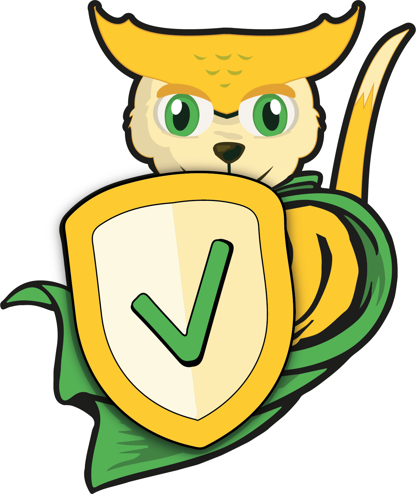

// SPDX-License-Identifier: MIT

:toc:
:toclevels: 4
:toc-placement!:

[link=https://github.com/mercedes-benz/sechub/actions?workflow=Java+%26+Go+CI]
image::https://github.com/mercedes-benz/sechub/workflows/Java%20&%20Go%20CI/badge.svg[Build status]

toc::[]

== SecHub

The free and open-source security platform SecHub, provides a central API to test software with different security tools.
SecHub supports many free and open-source as well as proprietary security tools.

SecHub features:

* <<user-perspective, Easy to use>>
* <<user-perspective, Scan using one API/client>>
* <<report, Single human readable report>>
* <<mark-false-positives, Mark findings as false-positive>>
* <<modules, Supports many security tools>>
* <<sechub-plugins, Provides IDE and text editor plugins>>

Supported security tools:

* <<codescan, Code scanners>>
* <<iacscan, IaC scanners>>
* <<secretscan, Secrets scanners>>
* <<webscan, Web scanners>>
* <<infrascan, Infrastructure scanners>>
* <<licensescan, License scanners>>

=== Getting Started

* https://mercedes-benz.github.io/sechub/latest/sechub-getting-started.html[SecHub Getting Started Guide]

=== Installation

Please visit https://github.com/mercedes-benz/sechub/wiki/ for detailed information.

=== Documentation

* https://mercedes-benz.github.io/sechub/[Documentation]

=== Introduction

SecHub orchestrates various security and vulnerability scanners which can find potential vulnerabilities in sourcecode, binaries or web applications.
This enables security, development and operation teams to review and fix security issues. As a result, SecHub improves application security.

.SecHub basic architecture overview
[[figure-architecture-overview]]
[ditaa]
....
                                                   +--------------+
                                              +--> | PDS + Tool A |
                                              |    +--------------+
+--------+                     +---------+    |
| SecHub | ---- scan data ---> | SecHub  | <--+
| Client | <---- report ------ |   API   | <--+
+--------+                     +---------+    |
                                              |    +--------------+
                                              +--> | PDS + Tool B |
                                                   +--------------+
....

The objective of SecHub is to help secure the software development lifecyle (SDLC) phases: development, deployment and maintenance. From the first written line of code to the application being in production. SecHub can be used to scan the software continuously.

The security tools are categorized into modules which are named after the security testing method they perform: `codeScan`, `licenseScan`, `secretScan`, `webScan` etc.

[NOTE]
--
The terms SAST (Static Application Security Testing) and DAST (Dynamic Application Security Testing) are intentionally not used for the module names, because the designers feel those terms are vague and difficult to understand for non-security experts. On the other hand, security experts can easily map: `codeScan` to SAST and `webScan` to DAST.
--

Because of the modules, the user only needs to understand what security testing a module performs, rather than to know what specific security tools are used for the actual scan. The user describes in a configuration file what module(s) to use. Or in other words, what security testing methods should be used to test the software with.

To start a scan, the user sends the configuration file to the SecHub server via API.
For ease of use SecHub offers a https://github.com/mercedes-benz/sechub/releases?q=%22client+version%22&expanded=true[client] which calls the REST API for the user.
The SecHub client can be used manually or can be integrated into a continuous-integration build pipeline (see below figure).

.CI/CD systems or users can scan with SecHub
[[figure-cicd-user-sechub]]
[ditaa]
....
/------\
| User | ----+
\------/     |            +--------+
             +-- Scan --> |        |
                          | SecHub |
             +-- Scan --> |        |
/-------\    |            +--------+
| CI/CD | ---+
\-------/
....

On receiving the user request, SecHub creates a job, delegates it to one or more security tools, collects the results and converts all into a report.
Next, the user can download the <<report,report>> in a JSON or HTML format.

[[user-perspective]]
=== User Perspective

SecHub is designed to provide an efficient user workflow. The basic idea of SecHub is, that the user has to do as little as possible to execute a security scan.
The user has two options: +
a) to use the https://mercedes-benz.github.io/sechub/latest/sechub-restapi.html[REST API] directly +
b) to use the https://mercedes-benz.github.io/sechub/latest/sechub-client.html[SecHub client]. +
Both can be integrated into a CI/CD pipeline.

Using the REST API requires several steps, which is fine if SecHub needs to be integrated into another software or platform.

However, it is recommended to use the SecHub client. +
The SecHub client reduces the workflow to three steps:

.SecHub three steps to scan
[[figure-three-steps-to-scan]]
[ditaa]
....

1. Create a configuration file  // (1)

/------+
| JSON |
+------/

2. Set Credentials // (2)

export SECHUB_USERID=myUserName…
…

3. Scan // (3)

+--------+                 +--------+
|        | ---- scan ----> |        |
| Client |                 | SecHub |
|        | <-- report ---- |        |
+--------+                 +--------+
....

(1) Create a https://mercedes-benz.github.io/sechub/latest/sechub-client.html#section-client-configuration-file[SecHub configuration] file. This step only needs to be done the first time.

(2) Provide the SecHub credentials. +
Example: +
`export SECHUB_USERID=myUserName` +
`export SECHUB_APITOKEN=NTg5YSMkGRkM2Uy00NDJjLTkYTY4NjEXAMPLE` +
`export SECHUB_SERVER=https://sechub.example.com:8443`

(3) Scan using `sechub scan`

Once the scan is finished, the client returns a <<report,report>>.

If the client is used to scan asynchronously it will return a `jobUUID` which can be used to get the report:

.Scan asynchronously
[[figure-scan-asynchronously]]
[ditaa]
....

1. Scan asynchronously // (1)

+--------+                     +--------+
|        | --- scanAsync ----> |        |
| Client |                     | SecHub |
|        | <--- jobUUID ------ |        |
+--------+                     +--------+

2. GetReport // (2)

+--------+                     +--------+
|        | --- getReport ----> |        |
| Client |                     | SecHub |
|        | <--- report ------- |        |
+--------+                     +--------+
....
(1) Scan asynchronously using `sechub scanAsync`. +
(2) Get report `sechub -jobUUID <jobUUID> getReport`.

In general, the `jobUUID` can be used to download the report again and again by different users and in different formats.

[[report]]
=== Report

SecHub collects the scan results from various security tools and converts them into a unified reporting format called: SecHub Report. The advantage is that the user needs to learn only one report format. The json-report below shows how a report can look like:

.JSON report example based on a scan of the https://securego.io/docs/rules/g101.html[G101], https://securego.io/docs/rules/g103.html[G103], https://securego.io/docs/rules/g304.html[G304] examples from GoSec.
[[json-report]]
[json]
----
{
   "result": {
      "count": 4,
      "findings": [
         {
            "id": 1,
            "description": "Potential hardcoded credentials",
            "name": "Potential hardcoded credentials",
            "severity": "HIGH",
            "code": {
               "location": "examples/g101.go",
               "line": 7,
               "column": 9,
               "source": "var password = \"f62e5bcda4fae4f82370da0c6f20697b8f8447ef\""
            },
            "type": "codeScan",
            "cweId": 798
         },
         {
            "id": 2,
            "description": "Use of unsafe calls should be audited",
            "name": "Use of unsafe calls should be audited",
            "severity": "MEDIUM",
            "code": {
               "location": "examples/g103.go",
               "line": 16,
               "column": 21,
               "source": "intPtr = (*int)(unsafe.Pointer(addressHolder))"
            },
            "type": "codeScan",
            "cweId": 242
         },
         {
            "id": 3,
            "description": "Use of unsafe calls should be audited",
            "name": "Use of unsafe calls should be audited",
            "severity": "MEDIUM",
            "code": {
               "location": "examples/g103.go",
               "line": 15,
               "column": 30,
               "source": "addressHolder := uintptr(unsafe.Pointer(intPtr)) + unsafe.Sizeof(intArray[0])"
            },
            "type": "codeScan",
            "cweId": 242
         },
         {
            "id": 4,
            "description": "Use of unsafe calls should be audited",
            "name": "Use of unsafe calls should be audited",
            "severity": "MEDIUM",
            "code": {
               "location": "examples/g103.go",
               "line": 15,
               "column": 56,
               "source": "addressHolder := uintptr(unsafe.Pointer(intPtr)) + unsafe.Sizeof(intArray[0])"
            },
            "type": "codeScan",
            "cweId": 242
         }
      ]
   },
   "messages": [],
   "reportVersion": "1.0",
   "trafficLight": "RED",
   "status": "SUCCESS",
   "jobUUID": "15a96c07-dcf3-4cbc-8d82-0acc9facd3a6"
}
----

The report can be downloaded in two flavors: JSON and HTML. Both are human readable. The HTML report is self-contained and can be read in any browser.
The JSON format is machine readable and can be read by the <<sechub-plugins, SecHub plugins>>.

[[mark-false-positives]]
==== Mark Findings as False-Positives

There are two major reasons for marking a security finding as false-positive: +
- It is an actual false-positive. +
- The finding is a false-positive in the context of the application. For example, the application is never deployed to be reachable from the internet.

Regardless the reason, https://mercedes-benz.github.io/sechub/latest/sechub-client.html#section-client-false-positives-mark[SecHub supports marking findings as false-positives]. The marking of false-positives is a SecHub feature and is independent of the security tools used to scan.

[[sechub-plugins]]
==== SecHub Plugins

The SecHub Plugins improve the user experience by enabling the user to work directly with the SecHub report in the IDE or text editor.

SecHub plugins exist for the following text editors and IDEs:

* Plugin for https://marketplace.eclipse.org/content/sechub[Eclipse IDE] (https://github.com/mercedes-benz/sechub-plugin-eclipse[source code])
* Plugin for https://github.com/mercedes-benz/sechub-plugin-intellij[IntelliJ platttform] (https://github.com/mercedes-benz/sechub-plugin-intellij[source code])
* Plugin for https://open-vsx.org/extension/mercedes-benz/sechub[VSCode, VSCodium, Eclipse Theia] (https://github.com/mercedes-benz/sechub-plugin-vscode[source code])

All plugins are free and open-source software (FOSS) and can be installed directly from within the IDE or text editors.

[[modules]]
=== Modules

Security tools are categorized into modules.

Each module performs a different security testing method:

* <<codescan, `codeScan`>> - scans code or binaries for potential vulnerabilities (weaknesses). +
  This includes SAST (static application security testing) and IaC (infrastructure as code).
* <<infrascan, `infraScan`>> - scans infrastructure for vulnerabilities.
* <<licensescan, `licenseScan`>> - scans code or artifacts for license information.
* <<secretscan, `secretScan`>> - scans code or artifacts for secrets (API tokens, certificates, passwords).
* <<webscan, `webScan`>> - scans a deployed web application for vulnerabilities. Also knows as DAST.

[[codescan]]
==== codeScan

__Alias: Static application security testing (SAST), static code analysis__

**Status: Productive**

The `codeScan` module scans source code or binary artifacts for potential vulnerabilities (weaknesses). To scan the user uploads the code or binary to SecHub. Once the files are uploaded, SecHub delegates the scan to one of many security tools.

More details: https://mercedes-benz.github.io/sechub/latest/sechub-client.html#sechub-config-code-scan

PDS-Solutions: +
- GoSec +
- PMD +
- FindSecurityBugs +
- Bandit +
- Checkmarx SAST (wrapper only) +
- … and more

[[iacscan]]
==== iacScan

__Alias: infrastructure-as-code (IaC) scan__

**Status: Productive**

The `iacScan` module scans infrastructure source code for potential vulnerabilities (weaknesses). To scan the user uploads the code or binary to SecHub. Once the files are uploaded, SecHub delegates the scan to one of many security tools.

More details: https://mercedes-benz.github.io/sechub/latest/sechub-client.html#sechub-config-iac-scan

PDS-Solutions: +
- Kics +

[[secretscan]]
==== secretScan

**Status: Productive**

Scans code or artifacts for secrets (API tokens, certificates, passwords).

PDS-Solutions: +
- Gitleaks

[[webscan]]
==== webScan

__Alias: Dynamic application security testing (DAST)__

**Status: Productive**

The `webScan` module scans running web applications for vulnerabilities. The only requirement is that the web application can be reached by SecHub via network.

More details: https://mercedes-benz.github.io/sechub/latest/sechub-client.html#web-scan

PDS-Solutions: +
- OWASP ZAP

[[infrascan]]
==== infraScan

**Status: Experimental**

The `infraScan` scans systems in a network.

More details: https://mercedes-benz.github.io/sechub/latest/sechub-client.html#infrastructure-scan

[[licensescan]]
==== licenseScan

**Status: Experimental**

The `licenseScan` module scans code or artifacts for license information.

PDS-Solutions: +
- Scancode +
- Tern

=== Architecture

SecHub is designed to execute hundreds of scans. It can scale horizontally and vertically. It can run on bare-metal, virtual machines, kubernetes or in the cloud.

The smallest useful setup is: a single SecHub server and a single product delegation server (PDS). Those two components are enough to start scanning.

For a larger setup, the number of SecHub server instances can be increased. More PDS instances can be added. +
The only requirements to scale SecHub are: a PostgreSQL database and an object store or file share.
SecHub and PDS instances use the PostgreSQL database to share information between instances.
For example, the job queue is kept in PostgreSQL. In addition,an object store or file share is necessary, so that all SecHub or PDS instances can store/read files.

Regardless of the backend complexity, whether one SecHub server or many are used the <<user-perspective, workflow for the user>> stays the same.

For more details about the architecture have a look at the architecture documentation: https://mercedes-benz.github.io/sechub/latest/sechub-architecture.html.

=== Operations Perspective

One needs to configure the scan tools as well as manage users and projects. +
For details please check the https://mercedes-benz.github.io/sechub/latest/sechub-operations.html[operations guide].

=== REST API

All user and administrative tasks can be done via https://mercedes-benz.github.io/sechub/latest/sechub-restapi.html[REST API]. SecHub is designed as a RESTful server.

=== Contributing

We welcome any contributions.
If you want to contribute to this project, please read the link:CONTRIBUTING.md[contributing guide].

=== Code of Conduct

Please read our https://github.com/mercedes-benz/foss/blob/master/CODE_OF_CONDUCT.md[Code of Conduct] as it is our base for interaction.

=== License

This project is licensed under the link:LICENSE[MIT LICENSE].

=== Provider Information

Please visit https://www.mercedes-benz-techinnovation.com/en/imprint/ for information on the provider.

Notice: Before you use the program in productive use, please take all necessary precautions,
e.g. testing and verifying the program with regard to your specific use.
The program was tested solely for our own use cases, which might differ from yours.
