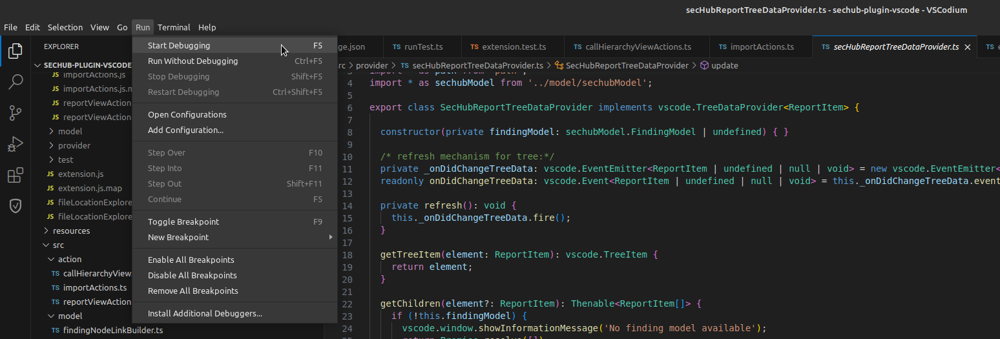

<!--- SPDX-License-Identifier: MIT -->

# SecHub VSCode/VSCodium/Eclipse Theia plugin

This is an VSCode/VSCodium/Eclipse Theia plugin for a convenient IDE integration of [SecHub](https://github.com/mercedes-benz/sechub).

## Features

* Read and navigate through SecHub reports
* Supported modules: `codeScan` and `secretScan`

## Installation

Recommended: Install the plugin from the Open-VSX marketplace from within [VSCodium](https://vscodium.com/) or [Eclipse Theia](https://theia-ide.org/) by searching for the term: `sechub` in the `Extensions` manager.

For VS Code you need to download the [plugin](https://open-vsx.org/extension/mercedes-benz/sechub) and install it manually. It is also possible to install the plugin manually in VSCodium and Eclipse Theia.

NOTE: Please use the new plugin from Mercedes-Benz: <https://open-vsx.org/extension/mercedes-benz/sechub>. The old Daimler plugin will be deprecated. The reason for the deprecation is the rebranding of Daimler to Mercedes-Benz.

## Development

### Develop

1. Install Node.js

    * [Windows, macOS and Linux](https://nodejs.org/en/download)
    * [`deb` and `rpm` packages (Debian/Ubuntu, RHEL/Fedora etc.)](https://github.com/nodesource/distributions/tree/master)
    * [Node.js releases](https://nodejs.dev/en/about/releases/)

2. Install Typescript compiler

    ~~~
    npm install -g typescript

    # or on Linux

    sudo npm install -g typescript

    # check version
    tsc --version
    ~~~

3. Install [VSCodium](https://vscodium.com/), [Eclipse Theia](https://theia-ide.org/) or [VSCode](https://code.visualstudio.com/)

    NOTE: VSCodium and Eclipse Theia distribute free/libre open source software binaries. VS Code, on the other hand, distributes non-free binaries and collects telemetry data.

4. In VSCodium toolbar: `Run -> Start Debugging`.

    

### Test

Prerequisite: The Node package manager NPM needs to be installed.

1. Install dependencies

    ~~~
    npm install
    ~~~

2. Compile and run tests

    ~~~
    npm test
    ~~~

    NOTE: The test automatically downloads and runs VS Code.

### Build

1. Install the vsce cli tool

    ~~~
    npm install -g @vscode/vsce

    # or on Linux

    sudo npm install -g @vscode/vsce
    ~~~

2. Build the plugin

    ~~~
    vsce package
    ~~~

## Contributing

We welcome any contributions.
If you want to contribute to this project, please read the [contributing guide](CONTRIBUTING.md).

## Code of Conduct

Please read our [Code of Conduct](https://github.com/mercedes-benz/foss/blob/master/CODE_OF_CONDUCT.md) as it is our base for interaction.

## License

This project is licensed under the link:LICENSE[MIT LICENSE].

## Provider Information

Please visit https://www.mercedes-benz-techinnovation.com/en/imprint/ for information on the provider.

Notice: Before you use the program in productive use, please take all necessary precautions,
e.g. testing and verifying the program with regard to your specific use.
The program was tested solely for our own use cases, which might differ from yours.
