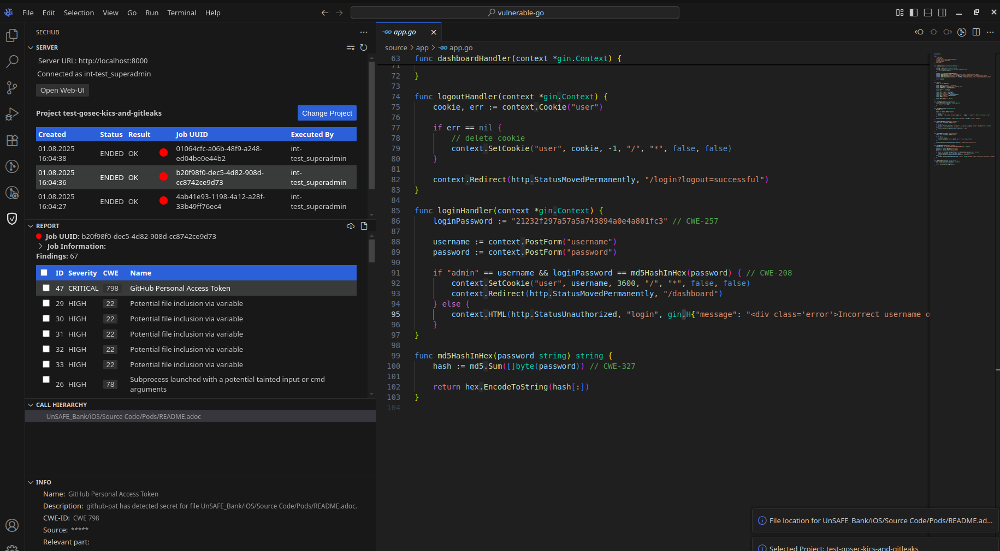

<!--- SPDX-License-Identifier: MIT -->
# SecHub plugin for VSCode, VSCodium and Eclipse Theia

This is a SecHub plugin for [VSCodium](https://vscodium.com/), [Eclipse Theia](https://theia-ide.org/) and [VS Code](https://code.visualstudio.com/) to read and navigate through SecHub reports.

## Installation

You can install this extension from [Open VSX](https://open-vsx.org/).

VSCodium and Eclipse Theia:
1. Open VS Code or any compatible editor.
2. Go to the Extensions view by clicking on the Extensions icon in the Activity Bar on the side of the window.
3. Search for `sechub`.
4. Click Install.

VSCode: download the [SecHub Plugin](https://open-vsx.org/extension/mercedes-benz/sechub) and install it manually.

NOTE: Please use the new plugin from Mercedes-Benz: <https://open-vsx.org/extension/mercedes-benz/sechub>. The old Daimler plugin will be deprecated. The reason for the deprecation is the rebranding of Daimler to Mercedes-Benz.

## Features

- **Import SecHub Reports**: Import SecHub `.json` reports from file system and navigate through them.
- **Connect to SecHub Server**: Connect to a SecHub server to view jobs and load reports directly from the server.
- **Fetch Remote Reports**: Fetch SecHub reports directly from the server.
- **Resolve Issues**: Resolve issues by marking them as false positives directly in the report.
- **Explain Vulnerablity by AI**: Use the AI-powered explanation feature to get detailed explanations of vulnerabilities.

## Usage

### Import SecHub reports from file

1. Open the Command Palette (Ctrl+Shift+P or Cmd+Shift+P on macOS) and type `SecHub: Import Report from File` to import a SecHub `.json` report from a file. 
Alternatively you can use the import button in the sidebar to import a SecHub report from a file.
2. Navigate through the report using the tree view in the sidebar (make sure the report belongs to your source code).
3. View the details of each issue by clicking on it in the tree view.


### Connect to SecHub Server

1. Open the Command Palette (Ctrl+Shift+P or Cmd+Shift+P on macOS) and type `SecHub: Change Server URL` or click on the UI `Server URL` to set the SecHub server URL.
2. Open the Command Palette again and type `SecHub: Change Credentials` or click on the UI `Disconnected` to set your SecHub server credentials
3. Select a SecHub project from the list of available projects via UI or by using the command `SecHub: Select Project`.
4. Click on the desired SecHub report in the sidebar to load it from the SecHub server.
5. Navigate through the report using the tree view in the sidebar.



### Resolve Issues

1. Open the report in the sidebar.
2. Click on the issue you want to resolve.
3. Check the checkbox in the issue details to mark it as a false positive/ resolved.
4. Click on the synchronize button in the table header to synchronize the changes with the SecHub server.
5. Select a reason for the resolution from the dropdown menu.
6. Optionally, add a custom comment to the resolution.


## Contributing

We welcome any contributions.
If you want to contribute to this project, please read our [CONTRIBUTING.md](../../CONTRIBUTING.md).

### Develop

1. Install Node.js

   * [Windows, macOS and Linux](https://nodejs.org/en/download)
   * [`deb` and `rpm` packages (Debian/Ubuntu, RHEL/Fedora etc.)](https://github.com/nodesource/distributions/tree/master)
   * [Node.js releases](https://nodejs.dev/en/about/releases/)

2. Build sechub api client and install dependencies by running the build script.
Additional run npm install to ensure eslint runs correctly.

   ```shell
    ./build-plugin.sh
    npm install
   ```

3. Install [VSCodium](https://vscodium.com/), [Eclipse Theia](https://theia-ide.org/) or [VSCode](https://code.visualstudio.com/)

   NOTE: VSCodium and Eclipse Theia distribute free/libre open source software binaries. VS Code, on the other hand, distributes non-free binaries and collects telemetry data.

4. Open the folder sechub/ide-plugins/vscode in your IDE

5. In VSCodium toolbar: `Run -> Start Debugging`.

   

6. Tipps:
- Adjust VS Code settings to align with the Prettier config:

   ```json
   {
     "editor.insertSpaces": true,
     "editor.tabSize": 4
   }
   ```
  
- Run eslint before committing (this will lint and format your code)

   ```shell
   npm run lint
   ```

#### Develop with SecHub Integrationtest Server

1. Start the SecHub Server as integration test server from your IDE (see [setup SecHub from IDE](https://mercedes-benz.github.io/sechub/latest/sechub-developer-quickstart-guide.html#setup-ide-for-sechub))

2. Start the proxy in a terminal `node devProxy.js` (Proxy on http://localhost:8000 -> https://localhost:8443 (sechub int test serevr)
   This step is necessary because of self singed SSL certificates.

3. Run the extension in toolbar: `Run -> Start Debugging`.

4. Set SecHub Server URL to http://localhost:8000 and the credentials to the default credentials e.g. use the int-test_superadmin user

### Test

Prerequisite: 
- The Node package manager NPM needs to be installed.
- The SecHub OpenAPI TypeScript client needs to be generated and built first (see [README.md](../../sechub-openapi-ts-client/README.md)).
- Extension tests follow the [VSCode test setup](https://code.visualstudio.com/api/working-with-extensions/testing-extension)

1. Install dependencies (make sure you have generated and build t+he sechub-openapi-typescript client first)

    ```shell
    npm install
    ```

2. Compile and run tests

    ```shell
    npm test
    ```

   NOTE: The test automatically downloads and runs VS Code.

### Build

To build the plugin, run the following command in the project root directory:

   ```shell
   ./build-plugin.sh
   ```

## Code of Conduct

Please read our [Code of Conduct](https://github.com/mercedes-benz/foss/blob/master/CODE_OF_CONDUCT.md) as it is our base for interaction.

## License

This project is licensed under the MIT License - see the [MIT LICENSE](./LICENSE).

## Provider Information

Please visit https://www.mercedes-benz-techinnovation.com/en/imprint/ for information on the provider.

Notice: Before you use the program in productive use, please take all necessary precautions,
e.g. testing and verifying the program with regard to your specific use.
The program was tested solely for our own use cases, which might differ from yours.

## Acknowledgements

- [VSCode codicons](https://github.com/microsoft/vscode-codicons) Copyright (c) Microsoft Corporation.
- [SecHub Logo](https://www.iconfinder.com/icons/1034363/advantage_protect_protection_security_shield_icon#size=128) by Aleksandr Reva, licensed as "Free for commercial use" under the [IconSet](https://www.iconfinder.com/iconsets/icons-for-a-site-1).