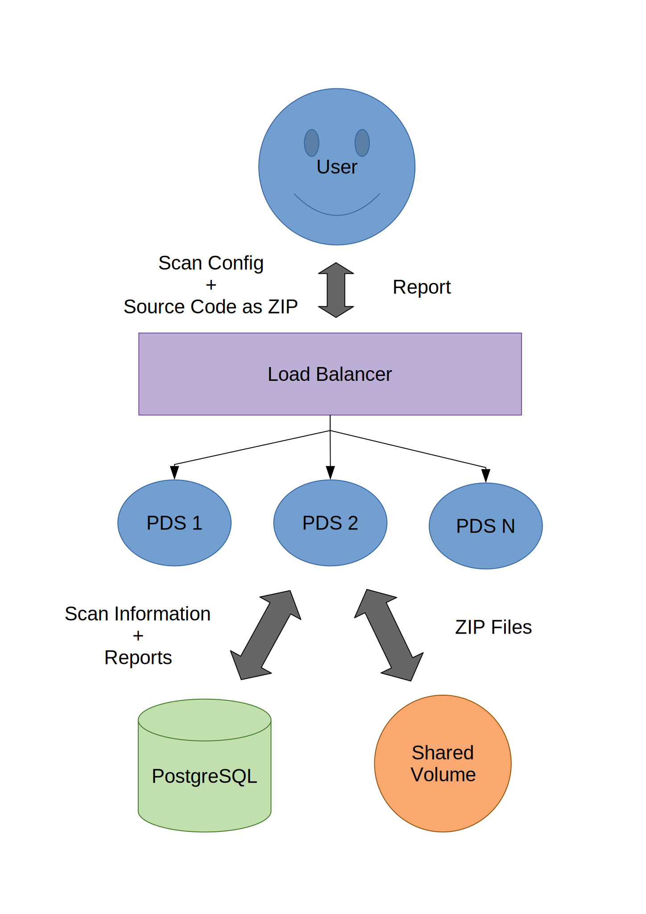

// SPDX-License-Identifier: MIT

:toc:
:numbered:

= Multiple Tools + PDS

WARNING: As of 14th of January 2020, SecHub SERECO is not able to process any of the resulting reports.

Run multiple free and open source static application security testing tools together with the https://daimler.github.io/sechub/latest/sechub-product-delegation-server.html[Product Delegation Server (PDS)]. A list of the included tools can be found below.

[[multiple-tools]]
|===
|Name |Supported Languages |License |PDS_PRODUCT_IDENTFIER

|https://github.com/PyCQA/bandit[Bandit]
|Python3
|Apache-2.0
|PDS_BANDIT

|https://dwheeler.com/flawfinder/[Flawfinder]
|C/C++
|GPL v2
|PDS_FLAWFINDER

|https://github.com/MobSF/mobsfscan[mobsfscan]
|Java, Kotlin, Swift, Objective-C
|LGPL-3.0
|PDS_MOBSFSCAN

|https://github.com/ajinabraham/njsscan[njsscan]
|NodeJS (JavaScript) 
|LGPL-3.0
|PDS_NJSSCAN
|===

The combination of the tools and PDS makes it possible to run both inside a Kubernetes cluser or virtual machines.

This folder contains the necessary scripts to run the multiple tools + PDS inside a container locally. Additionally, it contains scripts to build and push the container to your container registry and a Helm chart to install and run the tools + PDS in a Kubernetes cluster.

== Run Locally

This is the easiest way to get started.

=== Requirements

Docker and Docker-Compose need to be installed:

. https://docs.docker.com/engine/install/[Install Docker]

. Linux: https://docs.docker.com/engine/install/linux-postinstall/#manage-docker-as-a-non-root-user[Use Docker as non Root user]

. https://docs.docker.com/compose/install/[Install Docker-Compose]

=== Single Instance

Start a single instance either by using the Bash wrapper script which does setup everything <<automatic-start, automatically>> or follow the steps <<manual-start, manually>>.

[[automatic-start]]
==== Automatic

The folder contains a start script which does the <<manual-start, manual>> steps for you:

----
./01-start-docker-compose.sh
----

[[manual-start]]
==== Manually

. Copy `env-initial` file to `.env`

. Set values in `.env` file. The values are described in the `env-example` file.
+
[NOTE]
It is recommended to change the default passwords in the `.env` file to improve security. It is possible to change other values in the `.env` file as well. Any change requires a restart of the PDS+Multi container.

. Start container the Ubuntu container using https://docs.docker.com/compose/[Docker Compose]:
+
----
docker-compose --file docker-compose_pds_multi_ubuntu.yaml up --build
----

[[scan]]
=== Scan

The steps required to scan with the PDS. Scan manually if you are new to the PDS. Use the script, if you are tired of typing the same commands over and over again.

[[manual-scan]]
==== Scan Manually

. Go to PDS Bash command line (CLI) script
+
----
cd ../../sechub-developertools/scripts
----
+
The folder contains a `pds-api.sh` script.

. Set variables of your PDS instance.
+
----
export PDS_SERVER=https://<pds-host>:<pds-port>
export PDS_USERID=admin
export PDS_APITOKEN="<pds-admin-apitoken>"
----
+
The default values for the PDS-Multi `docker-compose` examples are:
+
----
export PDS_SERVER=https://localhost:8444
export PDS_USERID=admin
export PDS_APITOKEN="pds-apitoken"
----
+
[TIP]
Those values are the default values from `env-initial` and `env-cluster-initial` files. 

. Check if server is alive and running
+
----
./pds-api.sh check_alive
HTTP/1.1 200 <1>
X-Content-Type-Options: nosniff
X-XSS-Protection: 1; mode=block
Cache-Control: no-cache, no-store, max-age=0, must-revalidate
Pragma: no-cache
Expires: 0
Strict-Transport-Security: max-age=31536000 ; includeSubDomains
X-Frame-Options: DENY
Content-Length: 0
Date: Tue, 08 Jun 2021 16:38:02 GMT
----
+
<1> The `HTTP/1.1 200` tells you the server is alive and running.

. Create a new job to get the PDS JobUUID
+
----
./pds-api.sh create_job PDS_FLAWFINDER "288607bf-ac81-4088-842c-005d5702a9e9"
{
  "jobUUID": "8d4236cf-b512-40bc-bb70-c247fa4c9c37"
}
----

. Upload a ZIP file with Source code
+
----
./pds-api.sh upload_zip "8d4236cf-b512-40bc-bb70-c247fa4c9c37" /home/<myuser>/source_code.zip
----

. Mark the job ready to start
+
----
./pds-api.sh mark_job_ready_to_start "8d4236cf-b512-40bc-bb70-c247fa4c9c37"
----

. Check if the job is `DONE`
+
----
./pds-api.sh job_status "8d4236cf-b512-40bc-bb70-c247fa4c9c37"
{
  "jobUUID": "8d4236cf-b512-40bc-bb70-c247fa4c9c37",
  "owner": "pds-dev-admin",
  "created": "2021-06-08T16:45:00.111031",
  "started": "2021-06-08T16:52:42.407752",
  "ended": "2021-06-08T16:52:43.663005",
  "state": "DONE" <1>
}
----
+
<1> Job is `DONE`.

. Download the job result
+
----
./pds-api.sh job_result "8d4236cf-b512-40bc-bb70-c247fa4c9c37"
----
+
[NOTE]
The output depends on the uploaded `ZIP` file and the used product.

==== Scan Script 

It is recommended to start with a <<manual-scan, manual scan>> the first time using the PDS. However, after some time typing in the commands becomes very tedious. To improve on the experience you can scan using this script.

. Set the environment variables
+
----
export PDS_SERVER=https://<pds-host>:<port>
export PDS_USERID=admin
export PDS_APITOKEN="<pds-admin-apitoken>"
export PDS_PRODUCT_IDENTFIER=<product-identifier>
----
+
[NOTE]
The table with product identfier can be found in the <<multiple-tools, Multiple Tools + PDS>> section.
+
For example:
+
----
export PDS_SERVER=https://localhost:8444
export PDS_USERID=admin
export PDS_APITOKEN="pds-apitoken"
export PDS_PRODUCT_IDENTFIER=PDS_FLAWFINDER
----
+
[NOTE]
Those values are the default values from `env-initial` and `env-cluster-initial` files. In case you run PDS + Multi in Kubernetes or other environments those values will be different.

. Scan by providing a `ZIP` folder with source code.
+
----
./70-test.sh <path-to-zip-file>
----
+
For example:
+
----
./70-test.sh ~/myproject.zip
----

=== Cluster

The cluster is created locally via `docker-compose`.

==== Shared Volume

The cluster uses a shared volume defined in `docker-compose`. Docker allows to create volumes which can be used by multiple instances to upload files to. Reading, extracting and analysing the files is done in the PDS+Multi container.

The cluster consists of a PostgreSQL database, a Nginx loadbalancer and one or more PDS server.

===== Automatic

Starting several PDS + Multi instances:

----
./50-start-multiple-docker-compose.sh <replicas>
----

Example of starting 3 PDS + Multi instances:

----
./50-start-multiple-docker-compose.sh 3
----

===== Manually

. Copy `env-cluster-initial` file to `.env-cluster`
+
NOTE: It is recommended to change the passwords in `.env-cluster`. Other values can be changed as well. Be aware, that a change of values requires a restart of all containers in the cluster.

. Start cluster using https://docs.docker.com/compose/[Docker Compose]:
+
----
./50-start-multiple-docker-compose.sh <replicas>
----

==== Object Storage

The cluster uses an object storage to store files. The cluster uses https://github.com/chrislusf/seaweedfs[SeaweedFS] (S3 compatible) to store files. The PDS instance(s) use the object storage to upload files to. Reading, extracting and analysing the files is done in the PDS+Multi container.

The cluster consists of a PostgreSQL database, a Nginx loadbalancer, a SeaweedFS object storage and one or more PDS server.

image::../shared/media/cluster_object_storage.svg[Components of cluster with object storage]

===== Automatic

Starting several PDS + Multi instances

----
./51-start-multiple-object-storage-docker-compose.sh <replicas>
----

Example of starting 3 PDS + Multi instances

----
./51-start-multiple-object-storage-docker-compose.sh 3
----

===== Manually

. Copy `env-cluster-initial` file to `.env-cluster-object-storage`
+
NOTE: It is recommended to change the passwords in `.env-cluster-object-storage`. Other values can be changed as well. Be aware, that a change of values requires a restart of all containers in the cluster.

. Set `S3_ENABLED` to `true`.
+
----
S3_ENABLED=true
----

. Start cluster using https://docs.docker.com/compose/[Docker Compose]:
+
----
./51-start-multiple-object-storage-docker-compose.sh <replicas>
----

=== Change the Configuration

There are several configuration options available for the PDS+Multi `docker-compose` files. Have a look at `env-example` for more details.

=== Troubleshooting

This section contains information about how to troubleshoot PDS+Multi if something goes wrong.

==== Access the Ubuntu container

----
docker exec -it pds-multi-ubuntu bash
----

==== Java Application Remote Debugging of PDS

. Set `JAVA_ENABLE_DEBUG=true` in the `.env` file

. Connect via remote debugging to the `pds`
+
connect via CLI
(see: )
+
----
jdb -attach localhost:15024
----
+
TIP: https://www.baeldung.com/java-application-remote-debugging[Java Application Remote Debugging] and https://www.tutorialspoint.com/jdb/jdb_basic_commands.htm[JDB - Basic Commands]
+
or connect via IDE (e. g. Eclipse IDE, VSCodium, Eclipse Theia, IntelliJ etc.).
+
TIP: https://www.eclipse.org/community/eclipse_newsletter/2017/june/article1.php[Debugging the Eclipse IDE for Java Developers]

== Build Image and Push to Registry

Build container images and push them to registry to run PDS+Multi on virtual machines, Kubernetes or any other distributed system.

=== Build Image

Build the container image.

==== Ubuntu

. Using the default image: 
+
----
./10-create-ubuntu-image.sh my.registry.example.org/sechub/pds_multi_ubuntu v0.1
----

. Using your own base image:
+
----
./10-create-ubuntu-image.sh my.registry.example.org/sechub/pds_multi_ubuntu v0.1 "my.registry.example.org/ubuntu:focal"
----

=== Push Image to Registry

Push the container image to a registry.

* Push the version tag only
+
----
./20-push-image.sh my.registry.example.org/sechub/pds_multi_ubuntu v0.1
----

* Push the version and `latest` tags
+
----
./20-push-image.sh my.registry.example.org/sechub/pds_multi_ubuntu v0.1 yes
----

== Kubernetes

https://kubernetes.io/[Kubernetes] is an open-source container-orchestration system. This sections explains how to deploy and run PDS+Multi in Kubernetes.

=== Helm

https://helm.sh/[Helm] is a package manager for Kubernetes.

==== Requierments

* https://helm.sh/docs/intro/install/[Helm] installed
* `pds_multi_ubuntu` image pushed to registry

==== Installation

. Create a `myvalues.yaml` configuration file
+
A minimal example configuration file with one instance:
+
[source,yaml]
----
replicaCount: 1

image:
   registry: registry.app.corpintra.net/sechub/pds_multi_ubuntu
   tag: latest

pds:
   startMode: localserver

users:
   admin:
      id: "admin"
      apiToken: "{noop}<my-admin-password>"
   technical:
      id: "techuser"
      apiToken: "{noop}<my-technical-password>"

storage:
    local:
        enabled: true

networkPolicy:
    enabled: true
    ingress:
    - from:
        - podSelector:
            matchLabels:
                name: sechub-server
        - podSelector:
            matchLabels:
                name: sechub-adminserver
----
+
An example configuration file with 3 replicas, postgresql and s3 (MinIO) storage:
+
[source,yaml]
----
replicaCount: 3

image:
   registry: my.registry.example.org/pds_multi_ubuntu
   tag: latest

pds:
   startMode: localserver
   keepContainerAliveAfterPDSCrashed: true

users:
   admin:
      id: "admin"
      apiToken: "{noop}<my-admin-password>"
   technical:
      id: "techuser"
      apiToken: "{noop}<my-technical-password>"
      

database:
    postgres:
        enabled: true
        connection: "jdbc:postgresql://<my-database-host>:<port>/<my-database>"
        username: "<username-for-my-database>"
        password: "<password-for-my-database>"

storage:
    local:
        enabled: false
    s3:
        enabled: true
        endpoint: "https://<my-s3-object-storage>:443"
        bucketname: "<my-bucket>"
        accesskey: "<my-accesskey>"
        secretkey: "<my-secretkey>"

networkPolicy:
    enabled: true
    ingress:
    - from:
        - podSelector:
            matchLabels:
                name: sechub-server
        - podSelector:
            matchLabels:
                name: sechub-adminserver
----
+
[TIP]
To generate passwords use `tr -dc A-Za-z0-9 </dev/urandom | head -c 18 ; echo ''`, `openssl rand -base64 15`, `apg -MSNCL -m 15 -x 20` or `shuf -zer -n20  {A..Z} {a..z} {0..9}`.

. Install helm package from file system
+
----
helm install --values myvalues.yaml pds-multi helm/pds-multi/
----
+
[TIP]
Use `helm --namespace <my-namespace> install…` to install the helm chart into another namespace in the Kubernetes cluster.

. List pods
+
----
kubectl get pods
NAME                             READY   STATUS    RESTARTS   AGE
pds-multi-5c6c7845bf-2r2hs       1/1     Running   0          5h24m
pds-multi-5c6c7845bf-jkqj9       1/1     Running   0          28s
pds-multi-5c6c7845bf-p9rpz       1/1     Running   0          28s

----

. Forward port of one of the pods to own machine
+
----
kubectl port-forward pds-multi-5c6c7845bf-2r2hs 8444:8444
----

. Scan as explained in <<scan, scan>>.

==== Upgrade

In case, `my-values.yaml` was changed. Simply, use `helm upgrade` to update the deployment. `helm` will handle scaling up and down as well as changing the configuration.

----
helm upgrade --values my-values.yaml pds-multi helm/pds-multi/
----

==== Uninstall 

. Helm list
+
----
helm list
NAME     	NAMESPACE   	REVISION	UPDATED                                	STATUS  	CHART                          	APP VERSION
pds-multi	sechub-multi	1       	2022-01-12 14:45:04.019055446 +0100 CET	deployed	pds-multi-0.1.0                	0.24.0 
----

. Helm uninstall
+
----
helm uninstall pds-multi
----

=== Troubleshooting

* Access deployment events.
+
----
kubectl describe pod pds-multi-5c6c7845bf-2r2hs
…
Events:
Type    Reason     Age    From               Message
----    ------     ----   ----               -------
Normal  Scheduled  5h29m  default-scheduler  Successfully assigned sechub-multi/pds-multi-5c6c7845bf-2r2hs to c06p043-md-696c768794-sgmdj
Normal  Pulling    5h28m  kubelet            Pulling image "my.registry.example.org/sechub/pds_multi_ubuntu:latest"
Normal  Pulled     5h27m  kubelet            Successfully pulled image "my.registry.example.org/sechub/pds_multi_ubuntu:latest" in 59.535364375s
Normal  Created    5h27m  kubelet            Created container pds-multi
Normal  Started    5h27m  kubelet            Started container pds-multi
----

* Access container logs.
+
----
kubectl logs pds-multi-5c6c7845bf-2r2hs
  .   ____          _            __ _ _
 /\\ / ___'_ __ _ _(_)_ __  __ _ \ \ \ \
( ( )\___ | '_ | '_| | '_ \/ _` | \ \ \ \
 \\/  ___)| |_)| | | | | || (_| |  ) ) ) )
  '  |____| .__|_| |_|_| |_\__, | / / / /
 =========|_|==============|___/=/_/_/_/
 :: Spring Boot ::                (v2.5.2)

2022-01-12 08:21:59.641  INFO 6 --- [           main] d.s.p.ProductDelegationServerApplication : Starting ProductDelegationServerApplication using Java 11.0.13 on pds-multi-5c6c7845bf-2r2hs with PID 6 (/pds/sechub-pds-0.24.0.jar started by pds in /workspace)
2022-01-12 08:21:59.644  INFO 6 --- [           main] d.s.p.ProductDelegationServerApplication : The following profiles are active: pds_localserver,pds_postgres
2022-01-12 08:22:06.826  WARN 6 --- [           main] o.apache.tomcat.util.net.SSLHostConfig   : The protocol [TLSv1.3] was added to the list of protocols on the SSLHostConfig named [_default_]. Check if a +/- prefix is missing.
2022-01-12 08:22:07.125  INFO 6 --- [           main] o.apache.catalina.core.StandardService   : Starting service [Tomcat]
2022-01-12 08:22:07.125  INFO 6 --- [           main] org.apache.catalina.core.StandardEngine  : Starting Servlet engine: [Apache Tomcat/9.0.48]
2022-01-12 08:22:07.276  INFO 6 --- [           main] o.a.c.c.C.[Tomcat].[localhost].[/]       : Initializing Spring embedded WebApplicationContext
2022-01-12 08:22:07.699  INFO 6 --- [           main] com.zaxxer.hikari.HikariDataSource       : HikariPool-1 - Starting...
2022-01-12 08:22:08.254  INFO 6 --- [           main] com.zaxxer.hikari.HikariDataSource       : HikariPool-1 - Start completed.
2022-01-12 08:22:12.910  INFO 6 --- [           main] .s.s.AbstractSharedVolumePropertiesSetup : Using /shared_volumes/uploads as shared volume directory for uploads
2022-01-12 08:22:12.911  INFO 6 --- [           main] .s.s.AbstractSharedVolumePropertiesSetup : Upload directory set to:/shared_volumes/uploads
2022-01-12 08:22:12.911  INFO 6 --- [           main] c.d.s.p.storage.PDSMultiStorageService   : Created storage factory: SharedVolumeJobStorageFactory
2022-01-12 08:22:12.922  INFO 6 --- [           main] c.d.s.p.m.PDSHeartBeatTriggerService     : Heartbeat service created with 1000 millisecondss initial delay and 60000 millisecondss as fixed delay
2022-01-12 08:22:13.116  INFO 6 --- [           main] c.d.s.pds.batch.PDSBatchTriggerService   : Scheduler service created with 100 millisecondss initial delay and 500 millisecondss as fixed delay
2022-01-12 08:22:14.431  INFO 6 --- [           main] d.s.p.ProductDelegationServerApplication : Started ProductDelegationServerApplication in 24.823 seconds (JVM running for 33.554)
2022-01-12 08:22:15.456  INFO 6 --- [   scheduling-1] c.d.s.p.m.PDSHeartBeatTriggerService     : Heartbeat will be initialized
2022-01-12 08:22:15.458  INFO 6 --- [   scheduling-1] c.d.s.p.m.PDSHeartBeatTriggerService     : Create new server hearbeat
2022-01-12 08:22:15.506  INFO 6 --- [   scheduling-1] c.d.s.p.m.PDSHeartBeatTriggerService     : heartbeat update - serverid:MULTI_TOOL_CLUSTER, heartbeatuuid:96f40ee1-99bb-46fd-a118-8497cae0e709, cluster-member-data:{"hostname":"pds-multi-5c6c7845bf-2r2hs","ip":"192.168.128.138","port":8444,"heartBeatTimestamp":"2022-01-12T08:22:15.458913","executionState":{"queueMax":50,"jobsInQueue":0,"entries":[]}}
----