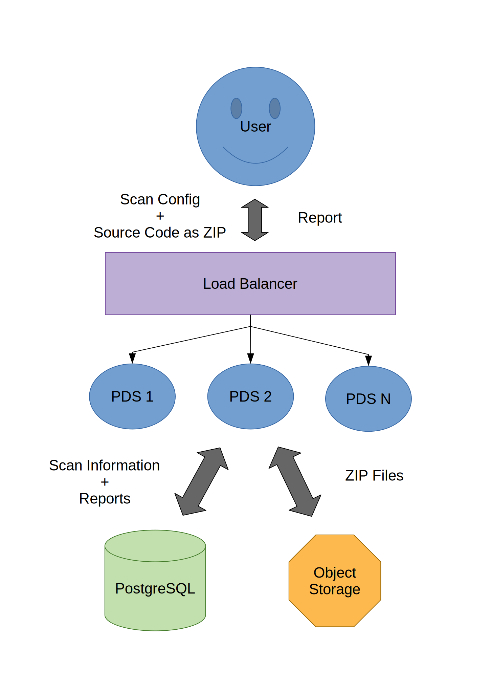

// SPDX-License-Identifier: MIT

:toc:
:numbered:

= IaC + PDS

Infrastructure as Code (IaC) is the practice of defining and managing computing infrastructure using code, which enables developers to automate the creation, configuration, and management of infrastructure resources. By combining IaC with the SecHub https://mercedes-benz.github.io/sechub/latest/sechub-product-delegation-server.html[Product Delegation Server (PDS)] in a container, IaC can be used with SecHub. Another scenario is to use IaC+PDS standalone.

The combination of IaC and PDS makes it possible to run both inside a Kubernetes cluser or virtual machines.

This folder contains the necessary scripts to run IaC+PDS inside a container locally. Additionally, it contains scripts to build and push the PDS + IaC container to your container registry and a Helm chart to install and run IaC+PDS in a Kubernetes cluster.

== Currently used tools
=== KICS
https://github.com/Checkmarx/kics[KICS] is a free and open source IaC commandline scanning tool

== Run Locally

This is the easiest way to get started.

=== Requirements

Docker and Docker-Compose need to be installed:

. https://docs.docker.com/engine/install/[Install Docker]

. Linux: https://docs.docker.com/engine/install/linux-postinstall/#manage-docker-as-a-non-root-user[Use Docker as non Root user]

. https://docs.docker.com/compose/install/[Install Docker-Compose]

=== Single Instance

Start a single instance by using the Bash wrapper script which does setup everything <<_automatic,automatically>> for you.

==== Scan script

The folder contains a start script which does the <<_manually, manual>> steps for you:

----
./01-start-docker-compose.sh
----

==== Together with SecHub

The container will be started and attached to the `sechub` Network.

WARNING: Make sure the SecHub container is running.

. Start container:
+
----
./05-start-single-sechub-network-docker-compose.sh
----

=== Scan

The steps required to scan with the PDS. Scan manually if you are new to the PDS. Use the script, if you are tired of typing the same commands over and over again.

==== Scan Script

It is recommended to start with a manual <<_scan>> the first time using the PDS. However, after some time typing in the commands becomes very tedious. To improve on the experience you can scan using this script.

. Set the environment variables
+
----
export PDS_SERVER=https://<pds-host>:<port>
export PDS_USERID=admin
export PDS_APITOKEN="<pds-admin-apitoken>"
export PDS_PRODUCT_IDENTFIER=PDS_KICS
----
+
For example:
+
----
export PDS_SERVER=https://localhost:8444
export PDS_USERID=admin
export PDS_APITOKEN="pds-apitoken"
export PDS_PRODUCT_IDENTFIER=PDS_KICS
----
+
[NOTE]
Those values are the default values from `env-initial` and `env-cluster-initial` files. In case you run PDS+IaC in Kubernetes or other environments those values will be different.

. Scan by providing a `ZIP` folder with Go source code.
+
----
cd ../shared/
./01-test.sh <path-to-zip-file>
----
+
For example:
+
----
cd ../shared/
./01-test.sh ~/myproject.zip
----

=== Cluster

The cluster is created locally via `docker-compose`.

==== Shared Volume

The cluster uses a shared volume defined in `docker-compose`. Docker allows to create volumes which can be used by multiple instances to upload files to. Reading, extracting and analysing the files is done in the IaC+PDS container.

The cluster consists of a PostgreSQL database, a Nginx loadbalancer and one or more PDS server.

image::../shared/media/cluster_shared_volume.svg[Components of cluster with shared volume]

===== Start Script

Starting several IaC+PDS instances:

----
./50-start-multiple-docker-compose.sh <replicas>
----

Example of starting 3 IaC+PDS instances:

----
./50-start-multiple-docker-compose.sh 3
----

==== Object Storage

The cluster uses an object storage to store files. The cluster uses https://github.com/chrislusf/seaweedfs[SeaweedFS] (S3 compatible) to store files. The PDS instance(s) use the object storage to upload files to. Reading, extracting and analysing the files is done in the IaC+PDS container.

The cluster consists of a PostgreSQL database, a Nginx loadbalancer, a SeaweedFS object storage and one or more PDS server.

===== Start Script

Starting several IaC+PDS instances

----
./51-start-multiple-object-storage-docker-compose.sh <replicas>
----

Example of starting 3 IaC+PDS instances

----
./51-start-multiple-object-storage-docker-compose.sh 3
----

=== Change the Configuration

There are several configuration options available for the IaC+PDS `docker-compose` files. Have a look at `env-example` for more details.

=== Troubleshooting

This section contains information about how to troubleshoot IaC+PDS if something goes wrong.

==== Access the container

----
docker exec -it pds-iac bash
----

==== Java Application Remote Debugging of PDS

. Set `JAVA_ENABLE_DEBUG=true` in the `.env` file

. Connect via remote debugging to the `pds`
+
connect via CLI
+
----
jdb -attach localhost:15024
----
+
TIP: https://www.baeldung.com/java-application-remote-debugging[Java Application Remote Debugging] and https://www.tutorialspoint.com/jdb/jdb_basic_commands.htm[JDB - Basic Commands]
+
or connect via IDE (e. g. Eclipse IDE, VSCodium, Eclipse Theia, IntelliJ etc.).
+
TIP: https://www.eclipse.org/community/eclipse_newsletter/2017/june/article1.php[Debugging the Eclipse IDE for Java Developers]

== Build Image and Push to Registry

Build container images and push them to registry to run IaC+PDS on virtual machines, Kubernetes or any other distributed system.

=== Build Image

Build the container image.

==== Build

. Using the default image:
+
----
./10-create-image.sh my.registry.example.org/sechub/pds_iac v0.1
----

. Using your own base image:
+
----
./10-create-image.sh my.registry.example.org/sechub/pds_iac v0.1 "my.registry.example.org/debian:11-slim"
----

=== Push Image to Registry

Push the container image to a registry.

* Push the version tag only
+
----
./20-push-image.sh my.registry.example.org/sechub/pds_iac v0.1
----

* Push the version and `latest` tags
+
----
./20-push-image.sh my.registry.example.org/sechub/pds_iac v0.1 yes
----

== Kubernetes

https://kubernetes.io/[Kubernetes] is an open-source container-orchestration system. This sections explains how to deploy and run PDS+IaC in Kubernetes.

=== Helm

https://helm.sh/[Helm] is a package manager for Kubernetes.

==== Requierments

* https://helm.sh/docs/intro/install/[Helm] installed
* `pds_iac` image pushed to registry

==== Installation

. Create a `myvalues.yaml` configuration file
+
A minimal example configuration file with one instance:
+
[source,yaml]
----
replicaCount: 1

image:
   registry: my.registry.example.org/sechub/pds_iac
   tag: latest

pds:
   startMode: localserver

users:
   admin:
      id: "admin"
      apiToken: "{noop}<my-admin-password>"
   technical:
      id: "techuser"
      apiToken: "{noop}<my-technical-password>"

storage:
    local:
        enabled: true

networkPolicy:
    enabled: true
    ingress:
    - from:
        - podSelector:
            matchLabels:
                name: sechub-server
        - podSelector:
            matchLabels:
                name: sechub-adminserver
----
+
An example configuration file with 3 replicas, postgresql and object storage:
+
[source,yaml]
----
replicaCount: 3

image:
   registry: my.registry.example.org/sechub/pds_iac
   tag: latest

pds:
   startMode: localserver
   keepContainerAliveAfterPDSCrashed: true

users:
   admin:
      id: "admin"
      apiToken: "{noop}<my-admin-password>"
   technical:
      id: "techuser"
      apiToken: "{noop}<my-technical-password>"

database:
    postgres:
        enabled: true
        connection: "jdbc:postgresql://<my-database-host>:<port>/<my-database>"
        username: "<username-for-my-database>"
        password: "<password-for-my-database>"

storage:
    local:
        enabled: false
    s3:
        enabled: true
        endpoint: "https://<my-s3-object-storage>:443"
        bucketname: "<my-bucket>"
        accesskey: "<my-accesskey>"
        secretkey: "<my-secretkey>"

networkPolicy:
    enabled: true
    ingress:
    - from:
        - podSelector:
            matchLabels:
                name: sechub-server
        - podSelector:
            matchLabels:
                name: sechub-adminserver
----
+
[TIP]
To generate passwords use `tr -dc A-Za-z0-9 </dev/urandom | head -c 18 ; echo ''`, `openssl rand -base64 15`, `apg -MSNCL -m 15 -x 20` or `shuf -zer -n20  {A..Z} {a..z} {0..9}`.

. Install helm package from file system
+
----
helm install --values myvalues.yaml pds-iac helm/pds-iac/
----
+
[TIP]
Use `helm --namespace <my-namespace> install…` to install the helm chart into another namespace in the Kubernetes cluster.

. List pods
+
----
kubectl get pods
NAME                             READY   STATUS    RESTARTS   AGE
pds-iac-545f5bc8-7s6rh         1/1     Running   0          1m43s
pds-iac-545f5bc8-px9cs         1/1     Running   0          1m43s
pds-iac-545f5bc8-t52p6         1/1     Running   0          3m

----

. Forward port of one of the pods to own machine
+
----
kubectl port-forward pds-iac-545f5bc8-7s6rh  8444:8444
----

. Scan as explained in <<_scan>>.

==== Upgrade

In case, `my-values.yaml` was changed. Simply, use `helm upgrade` to update the deployment. `helm` will handle scaling up and down as well as changing the configuration.

----
helm upgrade --values my-values.yaml pds-iac helm/pds-iac/
----

==== Uninstall

. Helm list
+
----
helm list
NAME     	NAMESPACE 	REVISION	UPDATED                                 	STATUS  	CHART                          	APP VERSION
pds-iac	my-namespace	1       	2021-06-24 21:54:37.668489822 +0200 CEST	deployed	pds-iac-0.1.0                	0.21.0
----

. Helm uninstall
+
----
helm uninstall pds-iac
----

=== Troubleshooting

* Access deployment events.
+
----
kubectl describe pod pds-iac-545f5bc8-7s6rh
…
Events:
  Type    Reason     Age   From               Message
  ----    ------     ----  ----               -------
  Normal  Scheduled  1m    default-scheduler  Successfully assigned sechub-dev/pds-iac-749fcb8d7f-jjqwn to kube-node01
  Normal  Pulling    54s   kubelet            Pulling image "my.registry.example.org/sechub/pds_iac:v0.1"
  Normal  Pulled     40s   kubelet            Successfully pulled image "my.registry.example.org/sechub/pds_iac:v0.1" in 13.815348799s
  Normal  Created    15s   kubelet            Created container pds-iac
  Normal  Started    10s   kubelet            Started container pds-iac
----

* Access container logs.
+
----
kubectl logs pds-iac-545f5bc8-7s6rh

  .   ____          _            __ _ _
 /\\ / ___'_ __ _ _(_)_ __  __ _ \ \ \ \
( ( )\___ | '_ | '_| | '_ \/ _` | \ \ \ \
 \\/  ___)| |_)| | | | | || (_| |  ) ) ) )
  '  |____| .__|_| |_|_| |_\__, | / / / /
 =========|_|==============|___/=/_/_/_/
 :: Spring Boot ::                (v2.4.0)

2021-06-09 14:46:07.310  INFO 7 --- [           main] d.s.p.ProductDelegationServerApplication : Starting ProductDelegationServerApplication using Java 11.0.11 on pds-iac-749fcb8d7f-jjqwn with PID 7 (/pds/sechub-pds-0.21.0.jar started by iac in /workspace)
2021-06-09 14:46:07.312  INFO 7 --- [           main] d.s.p.ProductDelegationServerApplication : The following profiles are active: pds_localserver
2021-06-09 14:46:08.945  INFO 7 --- [           main] o.apache.catalina.core.StandardService   : Starting service [Tomcat]
2021-06-09 14:46:08.945  INFO 7 --- [           main] org.apache.catalina.core.StandardEngine  : Starting Servlet engine: [Apache Tomcat/9.0.39]
2021-06-09 14:46:09.000  INFO 7 --- [           main] o.a.c.c.C.[Tomcat].[localhost].[/]       : Initializing Spring embedded WebApplicationContext
2021-06-09 14:46:09.228  INFO 7 --- [           main] com.zaxxer.hikari.HikariDataSource       : HikariPool-1 - Starting...
2021-06-09 14:46:09.485  INFO 7 --- [           main] com.zaxxer.hikari.HikariDataSource       : HikariPool-1 - Start completed.
2021-06-09 14:46:10.243  INFO 7 --- [           main] c.d.s.p.m.PDSHeartBeatTriggerService     : Heartbeat service created with 1000 millisecondss initial delay and 60000 millisecondss as fixed delay
2021-06-09 14:46:10.439  INFO 7 --- [           main] c.d.s.pds.batch.PDSBatchTriggerService   : Scheduler service created with 100 millisecondss initial delay and 500 millisecondss as fixed delay
2021-06-09 14:46:13.192  INFO 7 --- [           main] d.s.p.ProductDelegationServerApplication : Started ProductDelegationServerApplication in 6.783 seconds (JVM running for 7.27)
2021-06-09 14:46:14.206  INFO 7 --- [   scheduling-1] c.d.s.p.m.PDSHeartBeatTriggerService     : Heartbeat will be initialized
2021-06-09 14:46:14.206  INFO 7 --- [   scheduling-1] c.d.s.p.m.PDSHeartBeatTriggerService     : Create new server hearbeat
2021-06-09 14:46:14.255  INFO 7 --- [   scheduling-1] c.d.s.p.m.PDSHeartBeatTriggerService     : heartbeat update - serverid:IAC_CLUSTER, heartbeatuuid:a46b97b2-4cfb-449d-a171-42b255c4aab8, cluster-member-data:{"hostname":"pds-iac-749fcb8d7f-jjqwn","ip":"192.168.129.206","port":8444,"heartBeatTimestamp":"2021-06-09T14:46:14.207113","executionState":{"queueMax":50,"jobsInQueue":0,"entries":[]}}
----
