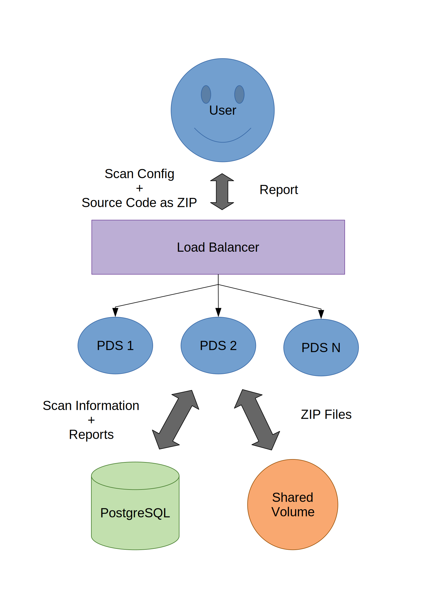

// SPDX-License-Identifier: MIT

:toc:

= OWASP ZAP + PDS

https://www.zaproxy.org/[OWASP ZAP] is a free and open source dynamic application security testing tool. By combining OWASP ZAP with the SecHub https://daimler.github.io/sechub/latest/sechub-product-delegation-server.html[Product Delegation Server (PDS)] in a container, OWASP ZAP can be used with SecHub.

Furthermore, the combination of OWASP ZAP and PDS make it possible to run both inside a Kubernetes cluser or virtual machines.

This folder contains the necessary scripts to run PDS + OWASP ZAP inside a container locally. Additionally, it contains scripts to build and push the PDS + OWASP ZAP container to your container registry and a Helm chart to install and run PDS + OWASP ZAP in a Kubernetes cluster.

== Run Locally

This is the easiest way to get started.

=== Requirements

Docker and Docker-Compose need to be installed:

. https://docs.docker.com/engine/install/[Install Docker]

. Linux: https://docs.docker.com/engine/install/linux-postinstall/#manage-docker-as-a-non-root-user[Run docker as non Root user]

. https://docs.docker.com/compose/install/[Install Docker-Compose]

=== Single Instance

Start a single instance either by using the Bash wrapper script which does setup everything <<automatic-setup,automatically>> or follow the steps <<manual-setup,manually>>.

[[automatic-setup]]
==== Automatically

The folder contains a start script which does the <<manual-setup, manual>> steps for you:

----
./01-start-docker-compose.sh
----

[[manual-setup]]
==== Manually

. Copy `env-initial` file to `.env`

. Set values in `.env` file. The values are described in the `env-example` file.
+
[NOTE]
It is recommended to change the default passwords in the `.env` file to improve security. It is possible to change other values in the `.env` file as well. Any change requires a restart of the container.

. Start container the Ubuntu container using https://docs.docker.com/compose/[Docker Compose]:
+
----
docker-compose --file docker-compose_pds_owasp_zap_ubuntu.yaml up --build
----

==== Together with SecHub

The container will be started and attached to the `sechub` Network.

IMPORTANT: Make sure the SecHub container is running.

. Start Ubuntu container:
+
----
./05-start-single-sechub-network-docker-compose.sh
----

[[scan]]
=== Scan

The steps required to scan with the PDS. Scan manually if you are new to the PDS. Use the script, if you are tired of typing the same commands over and over again.

[[manual-scan]]
==== Scan Manually

WARNING: Scan only targets you have permission to scan.

. Go to PDS Bash command line (CLI) script
+
----
cd ../../sechub-developertools/scripts
----
+
The folder contains a `pds-api.sh` script.

. Set variables of your PDS instance.
+
----
export PDS_SERVER=https://<pds-host>:<pds-port>
export PDS_USERID=admin
export PDS_APITOKEN="<pds-admin-apitoken>"
export PDS_PRODUCT_IDENTFIER=PDS_OWASP_ZAP
----
+
The default values for the PDS-OWASP-ZAP `docker-compose` examples are:
+
----
export PDS_SERVER=https://localhost:8444
export PDS_USERID=admin
export PDS_APITOKEN="pds-apitoken"
export PDS_PRODUCT_IDENTFIER=PDS_OWASP_ZAP
----
+
[TIP]
Those values are the default values from `env-initial` and `env-cluster-initial` files. 

. Check if server is alive and running
+
----
./pds-api.sh check_alive
HTTP/1.1 200 <1>
X-Content-Type-Options: nosniff
X-XSS-Protection: 1; mode=block
Cache-Control: no-cache, no-store, max-age=0, must-revalidate
Pragma: no-cache
Expires: 0
Strict-Transport-Security: max-age=31536000 ; includeSubDomains
X-Frame-Options: DENY
Content-Length: 0
Date: Tue, 08 Jun 2021 16:38:02 GMT
----
+
<1> The `HTTP/1.1 200` tells you the server is alive and running.

TODO: A JSON is needed for the target url

. Create a new job to get the PDS JobUUID
+
----
./pds-api.sh create_job PDS_OWASP_ZAP "288607bf-ac81-4088-842c-005d5702a9e9"
{
  "jobUUID": "8d4236cf-b512-40bc-bb70-c247fa4c9c37"
}
----

. Mark the job ready to start
+
----
./pds-api.sh mark_job_ready_to_start "8d4236cf-b512-40bc-bb70-c247fa4c9c37"
----

. Check if the job is `DONE`
+
----
./pds-api.sh job_status "8d4236cf-b512-40bc-bb70-c247fa4c9c37"
{
  "jobUUID": "8d4236cf-b512-40bc-bb70-c247fa4c9c37",
  "owner": "pds-dev-admin",
  "created": "2021-06-08T16:45:00.111031",
  "started": "2021-06-08T16:52:42.407752",
  "ended": "2021-06-08T16:52:43.663005",
  "state": "DONE" <1>
}
----
+
<1> Job is `DONE`.

. Download the job result
+
----
$ ./pds-api.sh job_result "8d4236cf-b512-40bc-bb70-c247fa4c9c37"
----

==== Scan Script 

WARNING: Scan only targets you have permission to scan.

It is recommended to start with a <<manual-scan,manual scan>> the first time using the PDS. However, after some time typing in the commands becomes very tedious. To improve on the experience you can scan using this script.

. Set the environment variables
+
----
export PDS_SERVER=https://<pds-host>:<port>
export PDS_USERID=admin
export PDS_APITOKEN="<pds-admin-apitoken>"
export PDS_PRODUCT_IDENTFIER=PDS_OWASP_ZAP
----
+
For example:
+
----
export PDS_SERVER=https://localhost:8444
export PDS_USERID=admin
export PDS_APITOKEN="pds-apitoken"
export PDS_PRODUCT_IDENTFIER=PDS_OWASP_ZAP
----
+
[NOTE]
Those values are the default values from `env-initial` and `env-cluster-initial` files. In case you run PDS+OWSAP-Zap in Kubernetes or other environments those values will be different.

. Scan by providing a `target-url` or a `path-to-json-config`.
+
----
./70-test-webscan.sh <target-url or path-to-json-config-file>
----
+
For example:
+
----
./70-test.sh https://my.juiceshop.org
----
+
or
+
----
./70-test.sh my-scan-config.json
----
+
.my-scan-config.json
[source,json]
----
{
    "apiVersion" : "1.0",
    "sechubJobUUID": "288607bf-ac81-4088-842c-005d5702a9e9", 
    "productId": "PDS_OWASP_ZAP",
    "parameters": [
        {
            "key" : "pds.scan.target.url",
            "value" : "https://my.juiceshop.org" 
        },
        {
            "key" : "zap.activescan.enabled",
            "value" : true
        },
        {
            "key" : "zap.ajaxcrawler.enabled",
            "value" : true
        }
    ]
}
----

=== Cluster

The cluster is created locally via `docker-compose`.

==== Shared Volume

The cluster uses a shared volume defined in `docker-compose`. Docker allows to create volumes which can be used by multiple instances to upload files to. Reading, extracting and analysing the files is done in the PDS+OWSAP-Zap container.

The cluster consists of a PostgreSQL database, a Nginx loadbalancer and one or more PDS server.

===== Automatic

Starting several PDS + OWSAP-Zap instances:

----
./50-start-multiple-docker-compose.sh <replicas>
----

Example of starting 3 PDS + OWSAP-Zap instances:

----
./50-start-multiple-docker-compose.sh 3
----

===== Manually

. Copy `env-cluster-initial` file to `.env-cluster`
+
NOTE: It is recommended to change the passwords in `.env-cluster`. Other values can be changed as well. Be aware, that a change of values requires a restart of all containers in the cluster.

. Start cluster using https://docs.docker.com/compose/[Docker Compose]:
+
----
./50-start-multiple-docker-compose.sh <replicas>
----

==== Object Storage

The cluster uses an object storage to store files. The cluster uses https://github.com/chrislusf/seaweedfs[SeaweedFS] (S3 compatible) to store files. The PDS instance(s) use the object storage to upload files to. Reading, extracting and analysing the files is done in the PDS+OWASP-ZAP container.

The cluster consists of a PostgreSQL database, a Nginx loadbalancer, a SeaweedFS object storage and one or more PDS server.

image::cluster_object_storage.svg[Components of cluster with object storage]

===== Automatic

Starting several PDS + OWASP-Zap instances

----
./51-start-multiple-object-storage-docker-compose.sh <replicas>
----

Example of starting 3 PDS + OWSAP-Zap instances

----
./51-start-multiple-object-storage-docker-compose.sh 3
----

===== Manually

. Copy `env-cluster-initial` file to `.env-cluster-object-storage`
+
NOTE: It is recommended to change the passwords in `.env-cluster-object-storage`. Other values can be changed as well. Be aware, that a change of values requires a restart of all containers in the cluster.

. Set `S3_ENABLED` to `true`.
+
----
S3_ENABLED=true
----

. Start cluster using https://docs.docker.com/compose/[Docker Compose]:
+
----
./51-start-multiple-object-storage-docker-compose.sh <replicas>
----

=== Change the Configuration

There are several configuration options available for the PDS+OWSAP-Zap `docker-compose` files. Have a look at `env-example` for more details.

=== Troubleshooting

This section contains information about how to troubleshoot PDS+OWSAP-Zap if something goes wrong.

==== Access the Ubuntu container

----
docker exec -it pds-owasp-zap-ubuntu bash
----

==== Java Application Remote Debugging of PDS

. Set `JAVA_ENABLE_DEBUG=true` in the `.env` file

. Connect via remote debugging to the `pds`
+
connect via CLI
(see: )
+
----
jdb -attach localhost:15024
----
+
TIP: https://www.baeldung.com/java-application-remote-debugging[Java Application Remote Debugging] and https://www.tutorialspoint.com/jdb/jdb_basic_commands.htm[JDB - Basic Commands]
+
or connect via IDE (e. g. Eclipse IDE, VSCodium, Eclipse Theia, IntelliJ etc.).
+
TIP: https://www.eclipse.org/community/eclipse_newsletter/2017/june/article1.php[Debugging the Eclipse IDE for Java Developers]

== Build Image and Push to Registry

Build container images and push them to registry to run PDS+OWSAP-Zap on virtual machines, Kubernetes or any other distributed system.

=== Build Image

Build the container image.

==== Ubuntu

. Using the default image: 
+
----
./10-create-ubuntu-image.sh my.registry.example.org/sechub/pds_owasp_zap v0.1
----

. Using your own base image:
+
----
./10-create-ubuntu-image.sh my.registry.example.org/sechub/pds_owasp_zap v0.1 "my.registry.example.org/ubuntu:focal"
----

=== Push Image to Registry

Push the container image to a registry.

* Push the version tag only
+
----
./20-push-image.sh my.registry.example.org/sechub/pds_owasp_zap v0.1
----

* Push the version and `latest` tags
+
----
./20-push-image.sh my.registry.example.org/sechub/pds_owasp_zap v0.1 yes
----

== Kubernetes

https://kubernetes.io/[Kubernetes] is an open-source container-orchestration system. This sections explains how to deploy and run PDS+OWSAP-Zap in Kubernetes.

=== Helm

https://helm.sh/[Helm] is a package manager for Kubernetes.

==== Requierments

* https://helm.sh/docs/intro/install/[Helm] installed
* `pds_owasp_zap` image pushed to registry

==== Installation

. Create a `myvalues.yaml` configuration file
+
A minimal example configuration file with one instance:
+
[source,yaml]
----
replicaCount: 1

image:
   registry: my.registry.org/sechub/pds_owasp_zap
   tag: latest

pds:
   startMode: localserver

owaspZap:
    apiKey: <my-apikey>

users:
   admin:
      id: "admin"
      apiToken: "{noop}<my-admin-password>"
   technical:
      id: "techuser"
      apiToken: "{noop}<my-technical-password>"

storage:
    local:
        enabled: true

networkPolicy:
    enabled: true
    ingress:
    - from:
        - podSelector:
            matchLabels:
                name: sechub-server
        - podSelector:
            matchLabels:
                name: sechub-adminserver
----
+
[TIP]
To generate passwords use `tr -dc A-Za-z0-9 </dev/urandom | head -c 18 ; echo ''`, `openssl rand -base64 15`, `apg -MSNCL -m 15 -x 20` or `shuf -zer -n20  {A..Z} {a..z} {0..9}`.

. Install helm package from file system
+
----
helm install --values myvalues.yaml pds-owasp-zap helm/pds-owasp-zap/
----
+
[TIP]
Use `helm --namespace <my-namespace> install…` to install the helm chart into another namespace in the Kubernetes cluster.

. List pods
+
----
kubectl get pods
NAME                                              READY   STATUS    RESTARTS   AGE
pds-owasp-zap-759ffc8dfb-8jj8f                    1/1     Running   0          75s
----

. Forward port of one of the pods to own machine
+
----
kubectl port-forward pds-owasp-zap-759ffc8dfb-8jj8f 8444:8444
----

. Scan as explained in the <<scan,scan>> section.

==== Upgrade

In case, `my-values.yaml` was changed. Simply, use `helm upgrade` to update the deployment. `helm` will handle scaling up and down as well as changing the configuration.

----
helm upgrade --values my-values.yaml pds-owasp-zap helm/pds-owasp-zap/
----

==== Uninstall 

. Helm list
+
----
helm list
NAME                          	NAMESPACE 	    REVISION	UPDATED                                 	STATUS  	CHART                          	APP VERSION
pds-owasp-zap                 	my-namespace	1       	2021-11-05 18:42:23.613991303 +0100 CET 	deployed	pds-owasp-zap-0.1.0            	0.24.0 
----

. Helm uninstall
+
----
helm uninstall pds-owasp-zap
----

=== Troubleshooting

* Access deployment events.
+
----
kubectl describe pod pds-owasp-zap-759ffc8dfb-8jj8f
…
Events:
  Type    Reason     Age    From               Message
  ----    ------     ----   ----               -------
  Normal  Scheduled  6m52s  default-scheduler  Successfully assigned sechub-zap/pds-owasp-zap-759ffc8dfb-8jj8f to c06p043-md-cc8c675cb-bqtpb
  Normal  Pulling    6m52s  kubelet            Pulling image "my.registry.org/sechub/pds_owasp_zap:latest"
  Normal  Pulled     6m31s  kubelet            Successfully pulled image "my.registry.org/sechub/pds_owasp_zap:latest" in 21.303104727s
  Normal  Created    6m30s  kubelet            Created container pds-owasp-zap
  Normal  Started    6m30s  kubelet            Started container pds-owasp-zap
----

* Access container logs.
+
----
kubectl logs pds-owasp-zap-759ffc8dfb-8jj8f

  .   ____          _            __ _ _
 /\\ / ___'_ __ _ _(_)_ __  __ _ \ \ \ \
( ( )\___ | '_ | '_| | '_ \/ _` | \ \ \ \
 \\/  ___)| |_)| | | | | || (_| |  ) ) ) )
  '  |____| .__|_| |_|_| |_\__, | / / / /
 =========|_|==============|___/=/_/_/_/
 :: Spring Boot ::                (v2.5.2)

2021-11-05 17:42:47.697  INFO 7 --- [           main] d.s.p.ProductDelegationServerApplication : Starting ProductDelegationServerApplication using Java 11.0.11 on pds-owasp-zap-759ffc8dfb-8jj8f with PID 7 (/pds/sechub-pds-0.24.0.jar started by zap in /workspace)
2021-11-05 17:42:47.702  INFO 7 --- [           main] d.s.p.ProductDelegationServerApplication : The following profiles are active: pds_localserver
2021-11-05 17:42:53.054  WARN 7 --- [           main] o.apache.tomcat.util.net.SSLHostConfig   : The protocol [TLSv1.3] was added to the list of protocols on the SSLHostConfig named [_default_]. Check if a +/- prefix is missing.
2021-11-05 17:42:53.131  INFO 7 --- [           main] o.apache.catalina.core.StandardService   : Starting service [Tomcat]
2021-11-05 17:42:53.132  INFO 7 --- [           main] org.apache.catalina.core.StandardEngine  : Starting Servlet engine: [Apache Tomcat/9.0.48]
2021-11-05 17:42:53.195  INFO 7 --- [           main] o.a.c.c.C.[Tomcat].[localhost].[/]       : Initializing Spring embedded WebApplicationContext
2021-11-05 17:42:53.498  INFO 7 --- [           main] com.zaxxer.hikari.HikariDataSource       : HikariPool-1 - Starting...
2021-11-05 17:42:53.776  INFO 7 --- [           main] com.zaxxer.hikari.HikariDataSource       : HikariPool-1 - Start completed.
2021-11-05 17:42:56.333  INFO 7 --- [           main] .s.s.AbstractSharedVolumePropertiesSetup : Using /shared_volumes/uploads as shared volume directory for uploads
2021-11-05 17:42:56.333  INFO 7 --- [           main] .s.s.AbstractSharedVolumePropertiesSetup : Upload directory set to:/shared_volumes/uploads
2021-11-05 17:42:56.334  INFO 7 --- [           main] c.d.s.p.storage.PDSMultiStorageService   : Created storage factory: SharedVolumeJobStorageFactory
2021-11-05 17:42:56.349  INFO 7 --- [           main] c.d.s.p.m.PDSHeartBeatTriggerService     : Heartbeat service created with 1000 millisecondss initial delay and 60000 millisecondss as fixed delay
2021-11-05 17:42:56.500  INFO 7 --- [           main] c.d.s.pds.batch.PDSBatchTriggerService   : Scheduler service created with 100 millisecondss initial delay and 500 millisecondss as fixed delay
2021-11-05 17:42:58.375  INFO 7 --- [           main] d.s.p.ProductDelegationServerApplication : Started ProductDelegationServerApplication in 13.2 seconds (JVM running for 14.465)
2021-11-05 17:42:59.394  INFO 7 --- [   scheduling-1] c.d.s.p.m.PDSHeartBeatTriggerService     : Heartbeat will be initialized
2021-11-05 17:42:59.394  INFO 7 --- [   scheduling-1] c.d.s.p.m.PDSHeartBeatTriggerService     : Create new server hearbeat
2021-11-05 17:42:59.467  INFO 7 --- [   scheduling-1] c.d.s.p.m.PDSHeartBeatTriggerService     : heartbeat update - serverid:OWASP_ZAP_CLUSTER, heartbeatuuid:d6b06e92-e3e6-4f39-aefb-eb70fee49ce7, cluster-member-data:{"hostname":"pds-owasp-zap-759ffc8dfb-8jj8f","ip":"192.168.128.4","port":8444,"heartBeatTimestamp":"2021-11-05T17:42:59.395871","executionState":{"queueMax":50,"jobsInQueue":0,"entries":[]}}
----